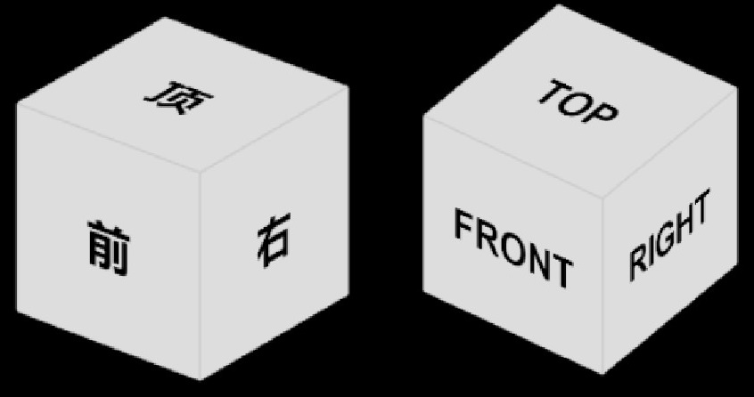

<h1 align="center">ViewCube for Three.js</h1>

A highly customizable standalone view cube addon for three.js with the following features:

- Customize face, edge, and corner color
- Customize position of view cube
- Customize size of view cube
- Customize text shown in each face of view. It can be used for internalization.



## Installation

You can install **Three ViewCube** via npm:

```bash
npm install @mlightcad/three-viewcube
```

## Usage

Use it with your `camera` and `renderer` instances.

```javascript
import { ViewCubeHelper } from '@mlightcad/three-viewcube'

// Create your renderer and set alhpa to true
const renderer = new THREE.WebGLRenderer({ alpha: true })

// Create your camera
const camera = ...

// Create your orbit controller
const cameraControls = new OrbitControls(camera, renderer.domElement)

// Create viewcube helper
const viewCubeHelper = new ViewCubeHelper(camera, renderer)
viewCubeHelper.setControls(cameraControls)

// Animation loop
function animate() {
  requestAnimationFrame(animate)
  renderer.clear()
  renderer.render(scene, camera)
  viewCubeHelper.render(renderer)
}

animate()
```

You can customize view cube by passing one `ViewCubeOptions` instance when creating one ViewCubeHelper instance. Defintion of `ViewCubeOptions` is as follows.

```javascript
/**
 * Options to customize view cube
 */
export interface ViewCubeOptions {
  /**
   * Position of view cube
   */
  pos?: ObjectPosition
  /**
   * Size of area ocupied by view cube. Because width and height of this area is same, it is single value.
   * The real size of view cube will be calculated automatically considering rotation.
   */
  dimension?: number
  /**
   * Face color of view cube
   */
  faceColor?: number
  /**
   * Color when hovering on face, edge, and corner of view cube
   */
  hoverColor?: number
  /**
   * Edge color of view cube
   */
  outlineColor?: number
  /**
   * Text in each face of view cube
   */
  faceNames?: FaceNames
}

```

For example, you can set view cube options as follows if you want to set text shown in each face to Chinese.

```javascript
import { FaceNames, ViewCubeHelper } from '@mlightcad/three-viewcube'

// Create you camera and render
......

const faceNames: FaceNames = {
  top: '顶',
  front: '前',
  right: '右',
  back: '后',
  left: '左',
  bottom: '底'
}
const viewCubeHelper = new ViewCubeHelper(camera, renderer, { faceNames: faceNames })

```

## References
- [viewcube demo project](https://codesandbox.io/s/y35w749501?file=/src/index.js)
- [three-viewport-gizmo](https://github.com/Fennec-hub/three-viewport-gizmo/)
- [three.js viewport helper](https://github.com/mrdoob/three.js/blob/dev/examples/jsm/helpers/ViewHelper.js)

